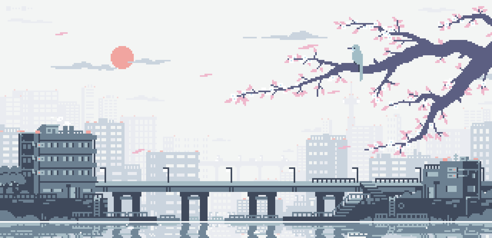
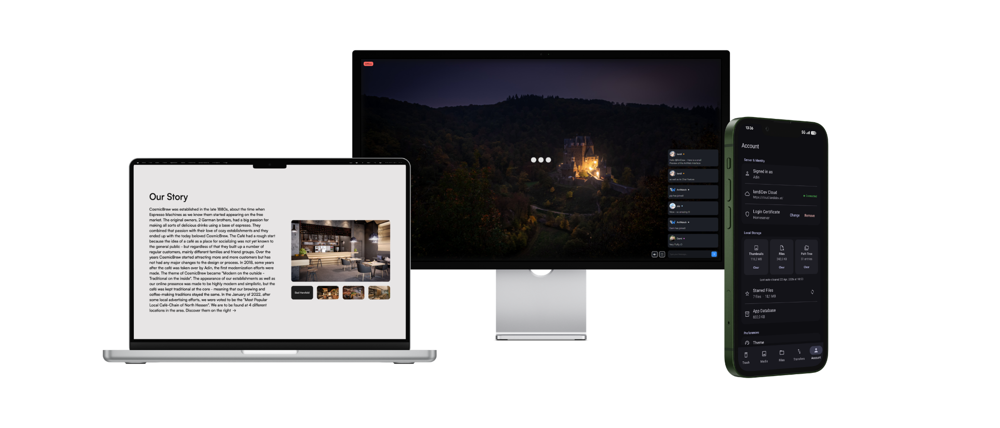

<i><small>Banner art by <a href="https://x.com/lennsan_">@lennsan_</a></small></i>

<h1 align="center">Hi, Im Adin 🍂</h1>

  <b>Full-Stack Development | Photography | Homelab Server</b>

---

### 📖 About me

> Im a young developer living in Germany, currently working at <a href="https://brockhaus-ag.de">Brockhaus AG</a>, and hoping to start my studies soon. I enjoy writing code that solves everyday challenges: whether its a full watch-together platform for me and my friends, a mobile client for my cloud storage, or some small local tools that make my life just a bit easier.

> When Im not actively developing a project, you can usually find me in nature with my camera, crocheting, tending to cats in the local shelter, reading a good fantasy book or enjoying some quality time with my friends.

### **What Im up to:**
- **Currently focusing on:** building out my homeserver setup and optimizing the network architecture.  
- **Looking forward to:** contribute more to the open-source community via GitHub.  
- **Gladly available for:** freelance website and system implementations, as well as contributions to projects. Lets chat!

---

### 💻 Coding Experience

 
  
 <i>Main languages I use to bring my ideas to life</i>

 
  
 <i>Frameworks I enjoy building with</i>

 
  
 <i>The backbone of my projects and deployments</i>

 
  
 <i>How I plan and craft clean user experiences</i>

---

### 🚀 What I have been building

  

  <i>I am hoping to publish these, and many more projects on GitHub soon!</i>

> ### 🌌 AniWatch
> A full ecosystem for watching content together with your friends  
> Includes a web interface with chat and synchronized video playback using SRS  
> Lays the framework for a discord webhook allowing notifications and session history

> ### 📱 Loft
> A Material UI mobile client for managing your FileRun instance on the go   
> Features an intuitive interface to upload, download and organise your files  
> Implements a secure server connection and local data storage / caching 

> ### ☕ CosmicBrew
> A modern and landing page for a fictional family run coffee shop  
> Focuses on modern aesthetics, responsive design, and a smooth user experience  
> Showcases a story with text and galleries designed to entice curiosity in visitors  

---

### 📊 GitHub Statistics

 

---

  <i>Thanks for stopping by! Feel free to reach out if you want to collaborate</i>

